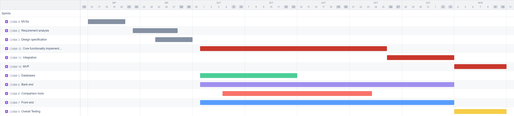

# Software Development Plan

## Communication Plan

All group members are available to meet after 6 PM on weekdays as needed and are present during class sessions, where we can discuss ideas and collaborate on the progress of our project effectively.

### Meeting Location(s)

We have decided to establish two different meeting locations for in-person collaboration and use Discord for remote meetings:

- Fawcett Hall 204 (After class): This location is conveniently located near our classroom, allowing us to easily transition from class to project work. It is ideal for casual discussions and quick updates when class is dismissed early.
- Library Annex 025 (Help Desk Lounge): This location is chosen for focused meetings and critical decision-making tasks, such as coding, debugging, or hands-on activities. The space provides a quieter, tech-equipped environment that facilitates deeper collaboration on key project milestones.

### Meeting Time(s)

- Fawcett Hall : 
  If our class is dismissed early, we will use the remaining time to discuss project updates and progress. If class runs its full length, we will hold a virtual meeting on Discord from 6:30 PM to 7:30 PM on Tuesdays and Thursdays to ensure we stay on track. This schedule accommodates all members' availability and offers a balance between in-person and remote work.
- Library Annex 025 : 
  For critical decision-making and hands-on activities, we will meet in person at the Library Annex (Room 025). These meetings will be scheduled in advance and reserved for key project milestones or tasks that require group collaboration. The location provides access to essential resources and tools needed for in-depth project work.

### Meeting Cadence

#### Weekly Meetings :

We will meet three times a week (two virtual and one in-person as needed) to ensure consistent progress and effective collaboration. The virtual meetings on Discord are scheduled after class to allow flexibility and ensure that all members can attend.

#### Ad-hoc Meetings :

We will call an ad-hoc meeting as needed for specific issues or in the case of a major discovery, with at least 24 hours’ notice. This provides the flexibility to address any urgent or unforeseen challenges in the project.

### Communication mechanism (s) for outside of meeting

For communication outside of meetings, we will use Discord to coordinate and discuss any project updates or questions.
Also, team members are expected to respond to discord messages within 2 hours during weekday evenings. (6PM – 10PM). This ensures prompt communication and decision-making when not in meetings.

## Timeline

### MVSs

- Date: End of week 5 (09/29/24)

### Design Specification

- Date: End of week 6 (10/06/24)

### Requirement Specification

- Date: End of week 7 (10/13/24)

### Milestones (i.e., "Checkins")

Milestone 1: Requirements and Design Completion
- Date: End of week 7 (10/13/24)
- Description: Complete the specification planning and upload documents.

Milestone 2: Core Functionality Implemented
- Date: End of Week 10 (11/03/24)
- Description: Initial implementation of core functionalities like backend APIs and basic front-end setup.

Milestone 3: Integration and Testing
- Date: End of Week 12 (11/17/24)
- Description: Complete integration of all system components and begin comprehensive testing, including bug fixing.

Milestone 4: Final MVP Version
- Date: End of Week 12 (11/17/24)
- Description: Delivery of the Minimum Viable Product (MVP) with core features fully implemented, integrated, and tested.
