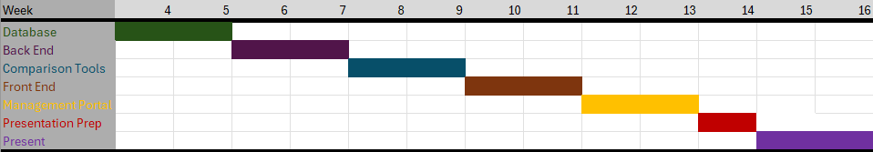

# Software Development Plan

## Communication Plan

All group members are available to meet after 6 PM on weekdays as needed and are present during class sessions, where we can discuss ideas and collaborate on the progress of our project effectively.

### Meeting Location(s)

We have decided to establish two different meeting locations for in-person collaboration and use Discord for remote meetings:

- Fawcett Hall 204 (After class)
- Library Annex 025 (Help Desk Lounge)

### Meeting Time(s)

- Fawcett Hall
  If our class is dismissed early, we will use the remaining time to discuss project updates and progress. If class runs its full length, we will hold a virtual meeting on Discord from 6:30 PM to 7:30 PM on Tuesdays and Thursdays to ensure we stay on track.
- Library Annex 025
  For critical decision-making and hands-on activities, we will meet in person at the Library Annex (Room 025). These meetings will be scheduled in advance and reserved for key project milestones or tasks that require group collaboration.

### Meeting Cadence

#### Weekly Meetings :

We will meet three times a week to ensure consistent progress.

#### Ad-hoc Meetings :

We will call an ad-hoc meeting as needed for specific issues or in the case of a major discovery, with at least 24 hours’ notice.

### Communication mechanism (s) for outside of meeting

For communication outside of meetings, we will use Discord to coordinate and discuss any project updates or questions.
Also, team members are expected to respond to discord messages within 2 hours during weekdays. (8 AM – 9 PM).

# Timeline

## MVSs

The Minimum Viable Specifications for CHIMERA are :

### 1. User Role

- Student, faculty and staff can submit disturbance report and view related data.
- Administrators can approve the submissions, manage entity and view reports.

### 2 .Disturbance Report Submission

Users can submit reports including name(optional), role, location of the disturbance, data and time of the event and detailed description of what was witnessed.

### 3 .Supernatural Entity Database

### 4 .Report Analysis

The machine learning system compares submitted reports with existing supernatural entities in the database to identify potential matches and a final report will be generated about the recurring disturbance.

### 5 . Security

    Ensure that user data is protected.

### 5 . Performance

    System should be able to handle multiple reports and entity for comparting and generating reports.

### 5 . Usability

Interface should be easy to navigate for non-technical users.

## Milestones (i.e., "Checkins")

## Requirement Specification

## Design Specification
